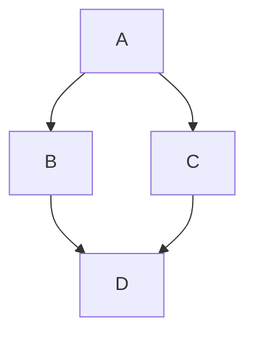

# PRESENTERM - Complete Documentation Reference

> This document is a compilation of documentation from https://github.com/mfontanini/presenterm
> For clean-room reimplementation reference purposes.

## Table of Contents

1. [Overview](#overview)
2. [Installation](#installation)
3. [Basic Concepts](#basic-concepts)
4. [Markdown Format](#markdown-format)
5. [Themes](#themes)
6. [Code Features](#code-features)
7. [Images](#images)
8. [Layouts](#layouts)
9. [Configuration](#configuration)
10. [Advanced Features](#advanced-features)

---

## Overview

**presenterm** is a terminal-based presentation tool that renders markdown files as slideshows.

### Key Features

- Presentations defined in single or multiple markdown files
- **Images and animated GIFs** on terminals (kitty, iterm2, wezterm, ghostty, foot)
- Highly customizable **themes** (colors, margins, layout, footer)
- Code highlighting for 50+ programming languages
- **Font sizes** for supported terminals (kitty 0.40.0+)
- Selective/dynamic code highlighting
- **Column layouts**
- **Mermaid diagram** rendering
- **D2 diagram** rendering
- **LaTeX and Typst formula** rendering
- Introduction slide generation
- **Snippet execution** for 20+ languages
- **Export to PDF and HTML**
- **Slide transitions** (fade, slide_horizontal, collapse_horizontal)
- Pause portions of slides (incremental reveals)
- Custom key bindings
- **Hot reload** during development
- **Speaker notes** support

---

## Installation

### Binary (Recommended)
Download from GitHub releases.

### Cargo
```bash
cargo install --locked presenterm
```

### Homebrew (macOS)
```bash
brew install presenterm
```

### Nix
```bash
nix-env -iA nixpkgs.presenterm
# or with flakes
nix run github:mfontanini/presenterm
```

### Arch Linux
```bash
pacman -S presenterm
```

### Windows (Scoop)
```bash
scoop install main/presenterm
```

### Windows (Winget)
```bash
winget install --id=mfontanini.presenterm -e
```

---

## Basic Concepts

### Running a Presentation

```bash
# Development mode (with hot reload)
presenterm examples/demo.md

# Presentation mode (no hot reload)
presenterm -p examples/demo.md

# With snippet execution enabled
presenterm -x examples/demo.md

# With snippet execution + replace enabled
presenterm -X examples/demo.md

# Validate all code snippets
presenterm --validate-snippets examples/demo.md

# Force image protocol
presenterm --image-protocol kitty-local examples/demo.md
```

### Navigation Keys

| Action | Default Key(s) |
|--------|----------------|
| Next slide | `l`, `j`, `→`, `↓`, `Space`, `Enter`, `PageDown` |
| Previous slide | `h`, `k`, `←`, `↑`, `Backspace`, `PageUp` |
| Next (fast - skip pauses) | `n` |
| Previous (fast) | `p` |
| First slide | `gg` |
| Last slide | `G` |
| Go to specific slide | `<number>G` |
| Execute code | `Ctrl+E` |
| Reload presentation | `r` |
| Toggle slide index | `Ctrl+P` |
| Toggle key bindings | `?` |
| Close modal | `Escape` |
| Exit | `q`, `Ctrl+C` |
| Suspend | `Ctrl+Z` |
| Toggle visual grid | `T` |

---

## Markdown Format

### Slide Separator

Slides are delimited by HTML comments:

```markdown
# First Slide
Content here...

<!-- end_slide -->

# Second Slide
More content...

<!-- end_slide -->
```

**Alternative:** Use `---` (thematic break) by enabling `end_slide_shorthand: true` in config.

### Front Matter (Introduction Slide)

```yaml
---
title: "My _first_ **presentation**"
sub_title: (in presenterm!)
author: Myself
date: 2024-01-01
event: Conference
location: San Francisco
---
```

All attributes are optional. The `title` supports markdown (bold, italics, code).

#### Multiple Authors

```yaml
---
title: Our first presentation
authors:
  - Me
  - You
---
```

### Slide Titles

Use setext-style headers (underlined with `===` or `---`):

```markdown
Slide Title
===========

Content here...

Slide Subtitle
--------------
```

### Supported Markdown Elements

- Headings (`# H1` through `###### H6`)
- **Bold**, _italics_, ~strikethrough~, `inline code`
- Ordered and unordered lists
- Code blocks (with syntax highlighting)
- Blockquotes
- Tables
- Links `[text](url)`
- Horizontal rules (thematic breaks)
- GitHub-style alerts:
  ```markdown
  > [!note]
  > This is a note
  
  > [!warning]
  > This is a warning
  
  > [!caution]
  > This is caution
  ```

### Colored Text

Using inline CSS in span tags:

```markdown
<span style="color: red; background-color: yellow">colored text!</span>
```

Or using theme palette classes:

```markdown
<span class="noice">colored text!</span>
```

(Define class in theme palette: `classes.noice.foreground: red`)

### Font Sizes

For terminals supporting kitty's font size protocol (0.40.0+):

```markdown
<!-- font_size: 2 -->
# Larger text
```

Or in theme definition for slide titles/headers.

### Pauses / Incremental Reveals

```markdown
# My Slide

This is shown first.

<!-- pause -->

This appears after pressing next.

<!-- pause -->

And this appears later.
```

### Incremental Lists

```markdown
<!-- incremental_lists -->

- First item (shown immediately)
- Second item (revealed on next)
- Third item (revealed later)
```

Configure behavior in settings:
```yaml
defaults:
  incremental_lists:
    pause_before: true
    pause_after: true
```

---

## Themes

### Built-in Themes

- `dark` (default)
- `light`
- Additional themes available in repository

### Using a Theme

In front matter:
```yaml
---
theme: light
---
```

Or in config file for default.

### Theme File Structure (YAML)

```yaml
# Root: default style for all slides
default:
  margin:
    percent: 8  # or fixed: 5
  colors:
    foreground: "e6e6e6"
    background: "040312"

# Introduction slide (shown if front matter has title/author)
intro_slide:
  title:
    alignment: center
    colors:
      foreground: "ffffff"
  author:
    alignment: center
    positioning: page_bottom  # or below_title
    colors:
      foreground: "aaaaaa"

# Slide titles (setext headers)
slide_title:
  prefix: "██"
  font_size: 2
  padding_top: 1
  padding_bottom: 1
  separator: true
  bold: true
  underlined: true
  italics: false
  colors:
    foreground: beeeff
    background: feeedd

# Headers h1-h6
headings:
  h1:
    prefix: "██"
    colors:
      foreground: beeeff
    bold: true
    underlined: false
    italics: false
  h2:
    prefix: "▓▓▓"
    colors:
      foreground: feeedd
  # ... h3 through h6

# Code blocks
block_quote:
  prefix: "▍ "
  colors:
    foreground: "aaaaaa"

# Lists
list:
  marker:
    colors:
      foreground: "ffffff"

# Tables
table:
  header:
    colors:
      foreground: "ffffff"
      background: "333333"
  rows:
    alternating:
      colors:
        foreground: "cccccc"
        background: "222222"

# Footer configuration
footer:
  style: template  # or progress_bar, empty
  left: "My **name** is {author}"
  center: "_@myhandle_"
  right: "{current_slide} / {total_slides}"
  height: 3
  
# Progress bar footer style
# footer:
#   style: progress_bar
#   character: 🚀

# No footer
# footer:
#   style: empty

# Color palette for span classes
palette:
  classes:
    noice:
      foreground: red
      background: blue
```

### Alignment Options

**Left/Right Alignment:**
```yaml
alignment: left  # or right
margin:
  fixed: 5       # exact character count
  # OR
  percent: 8     # percentage of terminal width
```

**Center Alignment:**
```yaml
alignment: center
minimum_size: 40        # minimum content width
minimum_margin:
  percent: 8            # minimum margin on each side
```

### Footer Images

```yaml
footer:
  style: template
  left:
    image: logo.png
  center: "Title"
  right:
    image: icon.png
  height: 5  # controls image scaling
```

Images are looked up:
1. Relative to presentation file
2. Relative to themes directory (`~/.config/presenterm/themes/`)

---

## Code Features

### Code Highlighting

Specify language after opening backticks:

~~~markdown
```rust
fn main() {
    println!("Hello, world!");
}
```
~~~

### Code Block Modifiers

~~~markdown
```rust +line_numbers
// Shows line numbers
```

```rust +no_background
// No background color
```

```rust +exec
// Executable code block (requires -x flag)
```

```rust +exec_replace
// Auto-execute and replace with output
```

```rust +validate
// Validate syntax without executing
```

```bash +pty
// Run in pseudo terminal
```

```bash +pty:80:30
// PTY with custom size (cols:rows)
```

```bash +pty:standby
// Show PTY area before execution
```

```rust +exec:rust-script
// Use alternative executor
```

```bash +image
// Output is rendered as image
```

```rust +acquire_terminal
// Run with raw terminal access
```
~~~

### Dynamic/Selective Highlighting

Highlight specific lines in sequence:

~~~markdown
```rust {1-4|6-10|all} +line_numbers
#[derive(Clone, Debug)]
struct Person {
    name: String,
}

impl Person {
    fn say_hello(&self) {
        println!("hello, I'm {}", self.name)
    }
}
```
~~~

Syntax: `{lineset1|lineset2|...}` where each step is shown on "next".

- `1-4` = lines 1 through 4
- `6-10` = lines 6 through 10
- `all` = entire code block
- `1,3,5` = lines 1, 3, and 5

### Snippet Execution

**Basic execution:**
~~~markdown
```bash +exec
echo "Hello, World!"
```
~~~

Press `Ctrl+E` to execute. Output appears below the code block.

**Execution with output placement:**
~~~markdown
```bash +exec +id:myoutput
echo "This output goes elsewhere"
```

<!-- end_slide -->

# Another Slide

<!-- snippet_output: myoutput -->
~~~

**PTY (interactive programs):**
~~~markdown
```bash +pty
top
```
~~~

**Alternative executors:**
- `rust +exec:rust-script` - Use rust-script for external crates
- `python +exec:pytest` - Run with pytest
- `python +exec:uv` - Run with uv

**Code to image:**
~~~markdown
```bash +image
cat my_diagram.png
```
~~~

Output must be JPG/PNG binary data only.

### Supported Languages for Execution

| Language | Default Executor | Alternative |
|----------|-----------------|-------------|
| bash/sh | bash | - |
| python | python3 | pytest, uv |
| rust | rustc | rust-script |
| javascript | node | - |
| typescript | ts-node | - |
| go | go run | - |
| ruby | ruby | - |
| php | php | - |
| perl | perl | - |
| lua | lua | - |
| r | Rscript | - |
| julia | julia | - |
| swift | swift | - |
| kotlin | kotlin | - |
| java | java | - |
| csharp | dotnet | - |
| c | gcc | - |
| cpp | g++ | - |
| fish | fish | - |
| zsh | zsh | - |

### Hiding Code Lines

Prefix with `# ` (comment + space) to hide:

~~~markdown
```rust +exec
# use std::thread::sleep;
# use std::time::Duration;
fn main() {
    // Only this line is shown
    println!("Hello!");
}
```
~~~

---

## Images

### Supported Protocols

- **kitty graphics protocol** - Best support
- **iTerm2 image protocol** - macOS
- **sixel** - Many terminals

### Supported Terminals

- kitty
- iTerm2
- WezTerm
- ghostty
- foot
- Any sixel-enabled terminal

### Basic Usage

```markdown

```

Paths are relative to the presentation file.

### Image Sizing

```markdown

      # shorthand
```

Image scales to percentage of terminal width while preserving aspect ratio.

### Image Protocol Detection

Auto-detected by default. Override with:
```bash
presenterm --image-protocol kitty-local presentation.md
```

Options:
- `auto` (default)
- `kitty-local` - Same host, filesystem access
- `kitty-remote` - Remote, escape codes only
- `iterm2`
- `sixel`

### tmux Compatibility

Enable passthrough:
```bash
tmux set-option -g allow-passthrough on
```

### Remote Images

**Not supported by design** - see issue #213.

---

## Layouts

### Column Layout

Define a layout with relative column widths:

```markdown
<!-- column_layout: [3, 2] -->
<!-- column: 0 -->

Left column (60% width)
- Point 1
- Point 2

<!-- column: 1 -->

Right column (40% width)
```

### Layout Reset

```markdown
<!-- reset_layout -->
```

Content after reset spans full width.

### Centering Content

Use column layout with empty side columns:

```markdown
<!-- column_layout: [1, 3, 1] -->
<!-- column: 1 -->

This content is centered (60% width)

<!-- reset_layout -->
```

### Layout Behavior

- Layout persists until:
  - `<!-- reset_layout -->`
  - Slide ends (`<!-- end_slide -->`)
  - Another column is selected (`<!-- column: N -->`)

---

## Configuration

### Config File Location

- Linux/macOS: `~/.config/presenterm/config.yaml`
- Windows: `%APPDATA%/presenterm/config.yaml`

### Default Theme

```yaml
defaults:
  theme: light
  # Or auto-detect based on terminal:
  theme:
    light: light
    dark: dark
```

### Terminal Font Size (Windows)

```yaml
defaults:
  terminal_font_size: 16
```

### Image Protocol

```yaml
defaults:
  image_protocol: kitty-local
```

### Maximum Presentation Dimensions

```yaml
defaults:
  max_columns: 100
  max_columns_alignment: center  # or left, right
  max_rows: 50
  max_rows_alignment: center     # or top, bottom
```

### Overflow Validation

```yaml
defaults:
  validate_overflows: always
  # Options: never, always, when_presenting, when_developing
```

### Slide Transitions

```yaml
transition:
  duration_millis: 750
  frames: 45
  animation:
    style: fade
    # Options: fade, slide_horizontal, collapse_horizontal
```

### Key Bindings

```yaml
bindings:
  next: ["l", "j", "", "", "", " "]
  previous: ["h", "k", "", "", ""]
  next_fast: ["n"]
  previous_fast: ["p"]
  first_slide: ["gg"]
  last_slide: ["G"]
  go_to_slide: ["G"]
  execute_code: [""]
  reload: [""]
  toggle_slide_index: [""]
  toggle_bindings: ["?"]
  close_modal: [""]
  exit: ["", "q"]
  suspend: [""]
```

### Snippet Execution Settings

```yaml
snippet:
  exec:
    enable: true
  exec_replace:
    enable: true
```

### Custom Executors

```yaml
snippet:
  custom:
    - name: my-executor
      extension: myext
      commands:
        - "mytool {code}"
```

---

## Advanced Features

### Including External Files

```markdown
<!-- include: path/to/file.md -->
```

### Speaker Notes

```markdown
# My Slide

Visible content.

???

This is speaker notes.
Only visible in notes mode.
```

View notes in separate window/monitor.

### Mermaid Diagrams

~~~markdown

~~~

Requires mermaid-cli (`mmdc`) installed.

### D2 Diagrams

~~~markdown
```d2
direction: right

A -> B
```
~~~

Requires d2 installed.

### LaTeX Formulas

~~~markdown
```latex
$$E = mc^2$$
```
~~~

Or inline:
```markdown
This is the quadratic formula: `$x = {-b \pm \sqrt{b^2-4ac} \over 2a}$`
```

Requires:
- `pdflatex` and `dvipng` for LaTeX
- Or `typst` for Typst (faster)

### Exporting

**PDF Export:**
```bash
presenterm --export pdf presentation.md -o output.pdf
```

**HTML Export:**
```bash
presenterm --export html presentation.md -o output.html
```

Requirements:
- `weasyprint` for PDF
- Built-in for HTML

### Modals

**Slide Index** (`Ctrl+P`):
- Shows all slides with titles
- Navigate directly to any slide

**Key Bindings** (`?`):
- Display all configured key bindings

### Visual Grid

Press `T` to toggle a visual grid overlay. Useful for debugging column layouts.

### Hot Reload

In development mode (default), file changes automatically reload the presentation. presenterm detects which slide was modified and jumps to it.

### Slide Title from First Heading

If first content on slide is a heading, it becomes the slide title (displayed in index, footer variables).

---

## Example Presentation

```markdown
---
title: "Demo Presentation"
author: "Developer"
date: "2024"
---

Welcome
=======

A demo of presenterm features.

<!-- end_slide -->

Code Example
============

Here's some Rust code:

```rust +exec
fn main() {
    println!("Hello from presenterm!");
}
```

<!-- end_slide -->

Column Layout
=============

<!-- column_layout: [2, 1] -->
<!-- column: 0 -->

Left side content:
- Point 1
- Point 2

<!-- column: 1 -->


<!-- reset_layout -->

Full width again.

<!-- end_slide -->

The End
=======

Thanks for watching!
```

---

*Documentation compiled from presenterm v0.x*
*Repository: https://github.com/mfontanini/presenterm*
